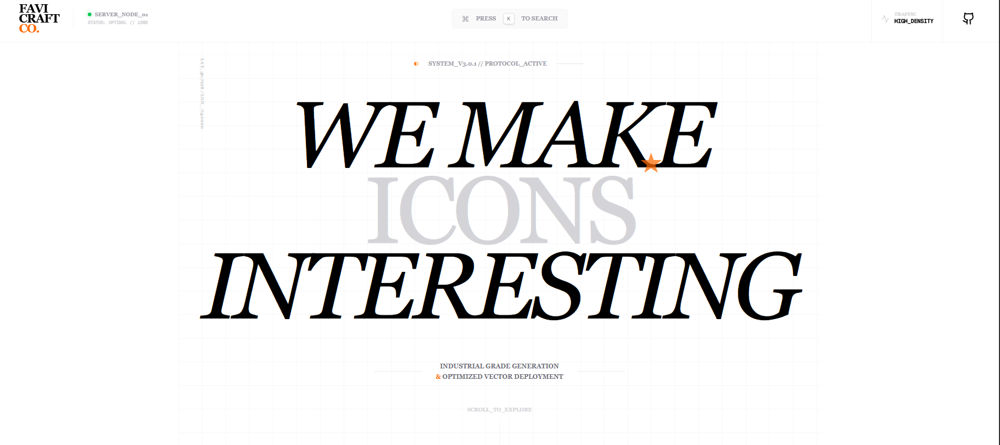

# [Favicraft Co. - Image to Favicons](https://favicraft.vercel.app)

Favicraft Co. is a high-performance industrial asset generator designed for modern web engineering. It deconstructs raw imagery into mathematical coordinates, refines them through Lanczos3 kernels, and produces high-fidelity favicon bundles. Whether you need a single retina asset or a full production-ready PWA manifest, Favicraft handles the heavy lifting with pixel-perfect precision.

Built for clarity, industrial speed, and technical depth - making your site's identity **Production Stable**.

[](./LICENSE)


[](https://github.com/byllzz)


[](https://favicraft.vercel.app)



⭐ Star the repo if you like it — help us build the legacy!


##  Features

- ✔️ **Lanczos3 Rendering Engine** — Highest-fidelity downsampling
- ✔️ **Multi-Format Export** — Standard, Retina, Apple Touch, Android PWA
- ✔️ **Automatic Manifest Generation** — `site.webmanifest` & `browserconfig.xml`
- ✔️ **Industrial Command Center** — Real-time telemetry & system logs
- ✔️ **Live Asset Inspector** — Metadata, color space, and depth analysis
- ✔️ **Theme Matrix Preview** — Test assets against Light, Dark, and Glass UI
- ✔️ **Bulk Batch Processing** — ZIP bundle generation with L9 compression
- ✔️ **Smart Header Injection** — Copy-paste ready meta-tag protocols
- ✔️ **GPU-Optimized UI** — 60fps animations with zero layout shift
- ✔️ **Zero Tracking** — Client-side privacy focused rendering
- ✔️ **Magnetic UI Nodes** — Interactive, physics-based scroll indicators
- ✔️ **Serverless Architecture** — Powered by Next.js & Sharp

---

##  How It Works

- **Ingestion:** Raw assets are deconstructed into mathematical coordinates via the `Vector_Parse` layer.
- **Refinement:** Pixels are recalculated using Lanczos3 bilinear filters for micro-scale clarity.
- **Manifest Generation:** The engine automatically writes technical XML and JSON metadata for cross-platform compliance.
- **Delivery:** Assets are packed using DEFLATE L9 compression into a single production-stable ZIP manifest.

---

## Installation & Setup

### Requirements
- Node.js (v18+)
- NPM or PNPM
- High-res source assets (SVG/PNG)

### Clone & Run
```bash
git clone https://github.com/byllzz/favicraft.git
cd favicraft
npm install
npm run dev
```
---

## 📄 License

This project is licensed under the **MIT License** — see [LICENSE.md](./LICENSE) for details.

---

##  Connect 

If you have suggestions or want to collaborate on the next technical node:

-  **Email the Lab**
-  **GitHub:** https://github.com/byllzz

---

<div align="center">

### SYSTEM_MANIFEST: ONLINE

Got a suggestion or want to collaborate on the next technical node?
**Email the Lab • GitHub Profile • Follow Updates**

<br/>

If you find this tool useful for your workflow, please leave a ⭐ **star!**

`STATUS: 200 OK // STABLE_RELEASE`

</p>
